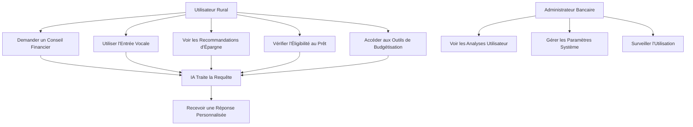
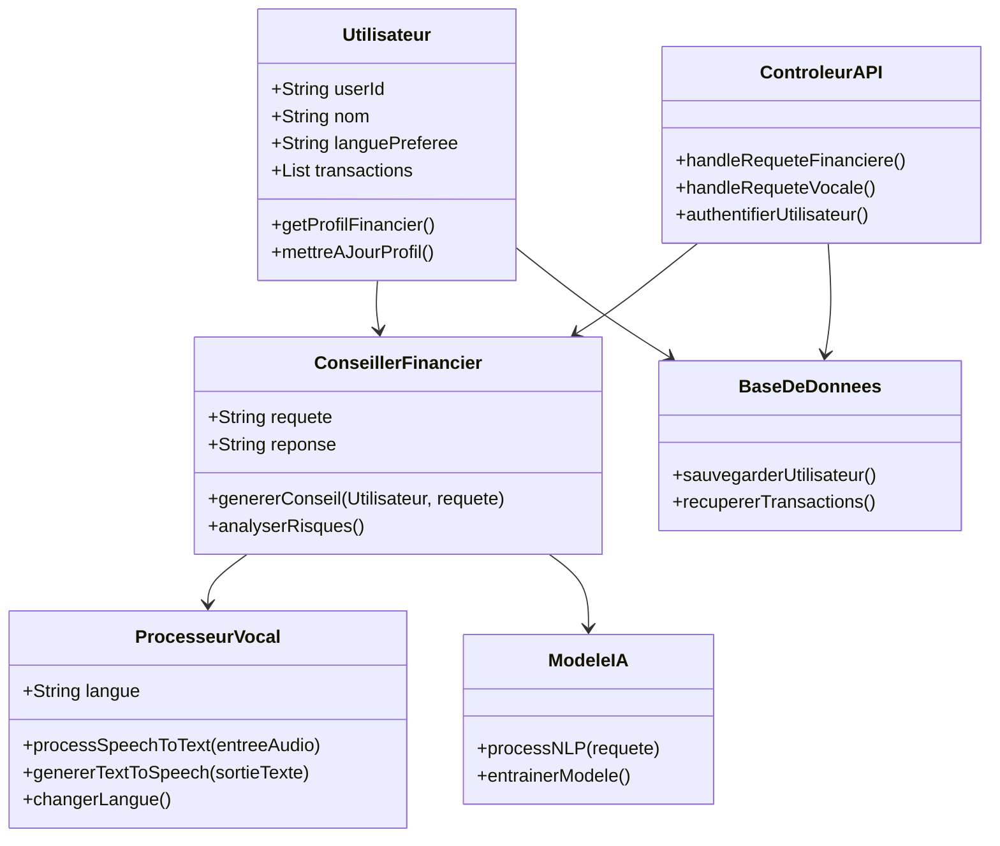
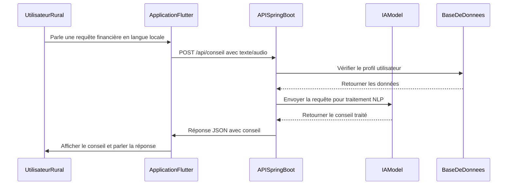
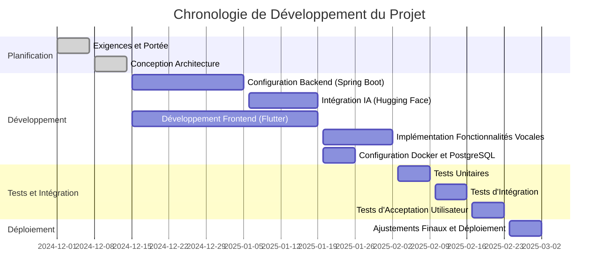

# Plan de Projet : Assistant Financier Intelligent pour Inclusion Bancaire Rurale

## Vue d'Ensemble

Ce projet développe une application mobile d'assistant financier intelligent pour l'inclusion bancaire rurale. Il utilise Flutter pour le frontend et Spring Boot pour le backend, en intégrant l'IA pour des conseils financiers personnalisés et un support vocal en anglais, français, arabe et darija marocain. L'application offre une évaluation d'éligibilité aux prêts, des recommandations d'épargne, des outils de budgétisation et des interactions vocales.

## Fonctionnalités Clés

- **Services Financiers** : Conseils sur les prêts, plans d'épargne, assistance budgétaire
- **Capacités IA** : NLP de base pour le chat et la conversion voix-texte utilisant des APIs gratuites
- **Support Vocal** : Reconnaissance et synthèse vocale multi-langues
- **Focus Rural** : Conçu pour les utilisateurs ruraux non bancarisés avec une interface simple et accessible

## Pile Technologique (Focus Gratuit/Open-Source)

- **Backend** : Spring Boot (Java) pour l'API REST
- **Frontend** : Flutter (Dart) pour l'application mobile cross-platform
- **IA** : Hugging Face Transformers (modèles gratuits pour NLP)
- **Traitement Vocal** : Plugins Flutter (speech_to_text, flutter_tts) avec quota gratuit de Google Speech API
- **Base de Données** : PostgreSQL avec Docker
- **Conteneurisation** : Docker pour le déploiement
- **Déploiement** : Heroku free tier ou local pour projet scolaire

## Architecture de Haut Niveau

- **Application Mobile (Flutter)** : Gère l'UI, l'entrée/sortie vocale, les appels API
- **Backend (Spring Boot)** : Traite les requêtes, intègre l'IA, gère les données
- **Couche IA** : APIs externes gratuites pour le traitement des requêtes financières

## Diagrammes

### Diagramme de Cas d'Utilisation

### Diagramme de Classes

### Diagramme de Séquence

### Diagramme de Gantt

## Meilleures Pratiques pour l'Excellence

- **Sécurité** : Implémenter l'authentification JWT, le chiffrement des données
- **Évolutivité** : Utiliser l'architecture microservices dans Spring Boot
- **Accessibilité** : Assurer que les fonctionnalités vocales fonctionnent hors ligne si possible
- **Tests** : Tests unitaires et d'intégration complets
- **Documentation** : Docs API avec Swagger, commentaires de code

Ce plan positionne le projet comme un devoir scolaire de haute qualité avec une applicabilité réelle.